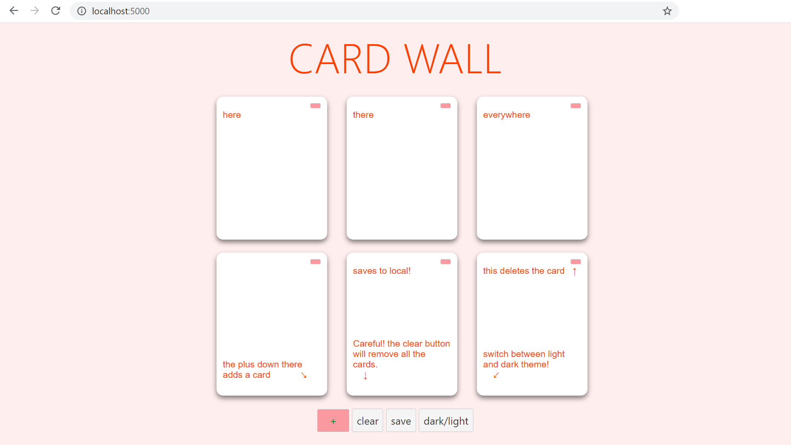

## pin board
An app to post stylish messages to a tab

## instructions for installation
- Install node js -> https://nodejs.org/en/
- Clone this git onto your local machine
- cd into the svelte-pin-board folder
- run `npm install`

## instructions to test the application
- run 'npm run dev'
- visit `localhost:5000` in a browser of your choice

## instructions to build the application
- run `npm run build`

## live link
http://svelte-pin-board.s3-website-ap-southeast-2.amazonaws.com/

## preview
